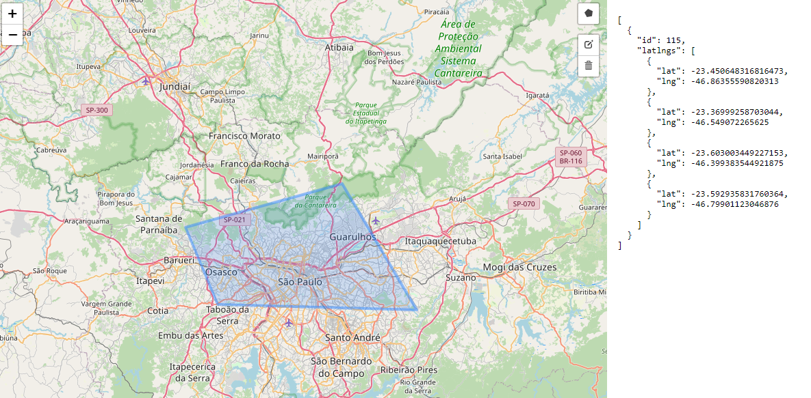

<p align="center">
  

  
  
  <a href="https://github.com/cadufc91/GeoJSON/commits/master">
    
  </a>
    
   
   <a href="https://github.com/cadufc91/GeoJSON/stargazers">
    
  </a>
  
 
</p>
<h1 align="center">
    
</h1>

<h4 align="center"> 
	🚧  GeoJSON - Finished 🚀 🚧
</h4>

<p align="center">
 <a href="#-about">About</a> •
  <a href="#-features">Features</a> • 
 <a href="#-how-it-works">How it works</a> • 
 <a href="#-tech-stack">Tech Stack</a> • 
 <a href="#-author">Author</a> • 
 <a href="#-license">License</a>
</p>


## 💻 About

GeoJSON - it's a project created to learn and train interactive map features.

---

## ⚙️ Features

- [x] Map central/initial localization at São Paulo - Brazil.
- [x] Map polygon drawing tool.
- [x] Polygon drawing editing tool on map.
- [x] Tool with return of coordinates of the drawing created on the map.

---

## 🚀 How it works

This project was developed only the Frontend.

### Pre-requisites

Before you begin, you will need to have the following tools installed on your machine:
[Git] (https://git-scm.com), [Node.js] (https://nodejs.org/en/).
In addition, it is good to have an editor to work with the code like [VSCode] (https://code.visualstudio.com/)


#### 🧭 Running the web application (Frontend)

```bash
# Clone this repository
$ git clone https://github.com/Cadufc91/GeoJSON.git
# Access the project folder in your terminal
$ cd GeoJSON
# Install the dependencies
$ npm install
# Run the application in development mode
$ npm run start
# The application will open on the port: 3000 - go to http://localhost:3000
```

---

## 🛠 Tech Stack

The following tools were used in the construction of the project:

#### **Website**  ([React](https://reactjs.org/)  +  [TypeScript](https://www.typescriptlang.org/))

-   **[React Leaflet](https://react-leaflet.js.org/)**
-   **[React Leaflet Draw](https://github.com/alex3165/react-leaflet-draw)**

> See file  [package.json](https://github.com/cadufc91/GeoJSON/blob/master/web/package.json)

**Utilities**
-   Prototype:  **[GeoJSON.io](https://geojson.io/#map=2/0/20/)**  
-   Editor:  **[Visual Studio Code](https://code.visualstudio.com/)**
-   Markdown:  **[StackEdit](https://stackedit.io/)**,  **[Markdown Emoji](https://gist.github.com/rxaviers/7360908)**


---

## 👨‍💻 Contributors

<table>
  <tr>
    <td align="center"><a href="https://cadufc-portfolio.vercel.app/"><br /><sub><b>Cadu Fernandes</b></sub></a><br /><a href="https://cadufc-portfolio.vercel.app/">👨‍💻</a></td>
  </tr>
</table>

## 💪 How to contribute

1. Fork the project.
2. Create a new branch with your changes: `git checkout -b my-feature`
3. Save your changes and create a commit message telling you what you did: `git commit -m" feature: My new feature "`
4. Submit your changes: `git push origin my-feature`

---
## 🦸 Author

<a href="https://cadufc-portfolio.vercel.app/">
 
 <br />
 <sub><b>Cadu Fernandes</b></sub></a> <a href="https://cadufc-portfolio.vercel.app/">🚀</a>
 <br />

 [](https://www.linkedin.com/in/carloseduardo-fernandes/) 
[](mailto:fernandes.cadu@gmail.com)

---

## 📝 License

This project is under the license [MIT](./LICENSE).

Made with love by Cadu Fernandes 👋🏽 [Get in Touch!](https://www.linkedin.com/in/carloseduardo-fernandes/)

---

##  README versions

[Portuguese 🇧🇷](./README.md)  |  [English 🇺🇸](./README-en.md) 